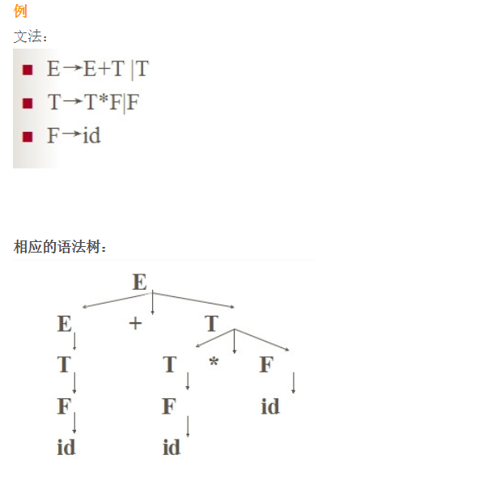
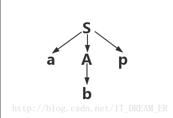
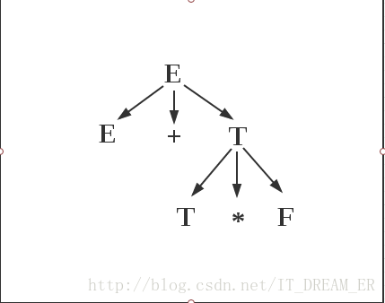
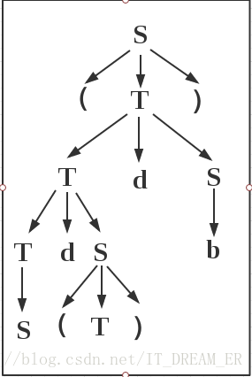

## 最左/最右推导

从右面/左面开始拆分

如：
$$
S->AB->Aab(最右)
$$

$$
S->AB->abB（最左）
$$

## 语法树

根据最左/最右推导得到的公式转化成的树

## 二义性

###### 在一些不能左右对称的运算符（如-）中，推导的不同可能导致歧义，即<u>一个句子对应多个语法树</u>

**造成二义性的原因是**：没有体现出结合性和优先级

###### 解决办法：

1. 改成非二义文法；
2. 规定优先级和结合性；
3. 改变语言的结构或书写方式。

## 短语

一个子树的所有子节点

如图，abp、b是短语

如图，E+TxF（第一层子树）、T*F（第二层子树）是短语

## 直接短语

深度为2的子树的叶子节点串

如图，短语S、（T）、Sd（T）、Sd(T)db、b、（Sd(T)db）

直接短语S、（T）、b

## 句柄

最左面的直接短语

如图，句柄为S

## 正则文法&正则表达式

#### 正则文法：

